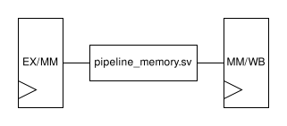

# ECE 411: mp_pipeline GUIDE

## Pipelined RV32I Processor

**This document, GUIDE.md, serves as a gentle, guided tour of the MP. For
strictly the specification and rubric, see [README.md](./README.md).**

# Getting Started
The intended CPU functionality will be similar to the CPU provided in Part 4 of `mp_verif`,
since they implement the same instruction set. We encourage you
to copy over any parts of that provided code you deem re-useable.

We recommend partitioning your design into multiple modules across many files
to keep your code readable. We highly suggest separating each pipeline
stage into their own module and to connect them together in `cpu.sv`.

We highly recommend using a struct for your pipeline stage registers.
We have provided some starter code in `pkg/types.sv`.
In `cpu.sv`, we suggest you do something like this:

```SystemVerilog
if_id_t if_id_reg, if_id_reg_next;

always_ff @(posedge clk) begin
  if_id_reg <= if_id_reg_next;
  // ...
end

id_stage id_stage_i (
  .if_id(if_id_reg),
  .id_ex(id_ex_reg_next)
);
```

## Gotchas

It is highly recommended that members of one struct are all assigned in a single always block.
This not only improves readability of your code, but also makes simulation faster.
We have also noted that if you do not do so, there is a rare chance you will trigger a bug
in VCS where the simulation behavior is undefined.

There is bug in DC where if you have a signal with the same name as a member in a struct in the
same file, DC will throw a "Internal Assertion Fault" and terminates itself. If you do see this
error, try to find any duplication in names in your code.

# The RV32I ISA
If you are unsure about what a specific instruction does,
it might be a good idea to check what the CPU in `mp_verif` does to execute that instruction.

In addition to Chapter 2 and Chapter 19, you should also familiarize yourself with
the RISC-V ISA from a programmer's perspective.
This includes assembler mnemonics and pseudo-instructions (such as `nop`) which will prove useful
when writing testcode and/or disassembling binaries. Refer to **Chapter 20** for more details.

## Gotchas

### `funct7`

Some instructions requires you to look at `funct7` to figure out which exact variant of the instruction it is.

### Misaligned `jal`/`jalr`

Note that `jal` and `jalr` requires you to mask out the last bit in the resulting PC.

# Design Tips

## Access Alignment
According to Section 2.6 of the RISC-V specification, a processor should include support for misaligned memory accesses.
However, for this MP, we will relax this requirement: you only need to support naturally aligned load and stores.
Simply put, this means that for an *n* byte piece of data, it is guaranteed that the address of the data mod *n* is 0.
In conjunction with the fact that the biggest datatype in RV32I is 32-bit integers, the consequence of this
is that all pieces of data will be contained within a single, 4-byte aligned word.

Non-naturally aligned memory accesses will not be tested. As a result, you do not need to implement trap logic.

When interacting with memory, you should always use 4-byte aligned addresses as outputs to `imem_addr` and `dmem_addr`.
To specify which part of the 4 bytes to access, use the `w/rmask`. Each `1` bit in the `w/rmask` indicates the validity
of the respective byte in the 4-byte word. A non-zero `w/rmask` indicates a write/read request to the memory.

For example, if your processor were to write the byte at address `0x10000002`, your processor should set `addr` as `0x10000000`,
set `w/rmask` to `4'b0100` (note address are zero indexed hence `0x2` translated to the 3rd place), and `wdata` shifted:
say you are trying to write `0x000000A5`, then your 32-bit `wdata` should be `0xXXA5XXXX`.

## Branch Prediction
In order to avoid excessive stalls in a pipelined processor, a branch predictor is necessary. This is because after
fetching a branch instruction, you would like to continue fetching the next instruction in the following cycle.
However, since the branch instruction will not yet have resolved, your CPU will instead need to make a *prediction*
about which address is correct. For this MP, you may simply use a static-not-taken branch predictor.
This predictor always assumes branches will not be taken, i.e. your fetch stage will always fetch the next instruction (`pc`+4) and flush the
erroneously fetched instructions if the branch is later resolved to be taken.

## Flushing
Since the branch predictor cannot guarantee a correct prediction, you may have invalid instructions fetched/executed
after a branch instruction. Therefore, when a branch mis-prediction is detected, your processor must flush all the wrong instructions
in the pipeline to prevent them from affecting the correctness of your CPU's execution.

You can do so either by having a valid bit in your pipeline registers, and setting this to invalid on a flush,
or by changing those signals that will modify the architectural state (hint: registers and memory) to something where they would not.
Assigning every signal in the pipeline register to equal to `nop` is not recommended as that wastes a lot of area and power
to accomplish the same effect as having a correctly implemented valid bit.

## Stalling
Not every stage in the pipeline takes exactly one cycle. The instruction fetch and memory stages both might wait for
memory to respond before their work is completed, which may take multiple cycles. This will require your processor to
stall.

You may choose to stall your entire processor when encountering a stall situation, or only stall the current stage and any stage before it
(sometimes called back pressure or partial stalls).
If you choose to implement partial stalls, stages will be decoupled in the sense
that later stage can move on their own without early stage following them.

## Next Cycle Memory Response / Pipelined Memory

You might have noticed that, the memory responds in the next cycle instead of the same cycle.
A naive implementation of this MP might look like this:



This comes with some issues. The pipeline register `MM/WB` will actually get the data 2 cycles after the initial request.
Let's open the black box of this memory model a bit. Since it has a one cycle delay, we can infer that it probably looks
like this:


"SRAM" block in this diagram is some purely combinational logic.
We will talk about SRAM in detail in mp_cache.
Note that in synthesis we are using this exact configuration, with register in the front.

This will explain why the naive implementation would not work. We are making our pipeline 6 or 7 stages instead of 5!


How do we solve this problem? One thing we could do is to view the memory model register as part of the `EX/MM` pipeline
register:


This is our recommended method of dealing with pipelined memory.

How this configuration interacts with stalling and flushing is left as an exercise to the reader.

### Reset Correctness

Since we are considering these registers in the memory model as part of our pipeline registers, they should be reset in the same way.
However, this is not entirely straightforward. The memory model’s register does not have a reset function;
it will always take in the next value. How to deal with this is left as an exercise for the reader.

## Forwarding
We recommend you refer to the lectures or the textbook (Computer Organization and Design the Hardware/Software Interface RISC-V edition by Patterson & Hennessy in section 4.7), where this topic is discussed in detail.

# Verification
You can use the provided memory models and load RISC-V programs into your design.
Then you may use Spike to generate the golden trace for your program.

You can also use the random testbench from your `mp_verif` to test your CPU.

You must use RVFI to help check the correctness of your processor.

Here are some recommended targeted tests that we think you should write:

- Every required instruction
  - Including their corner cases, such as when a negative number is involved, etc.
  - This could be generated using a Python script.
- All the forwarding paths:
  - The number of forwarding paths depends on your design. The following are the common ones:
    - MM -> EX
    - WB -> EX
    - WB -> MM
    - Transparent register file
  - Also test forwarding when the source and/or target instruction is flushed/invalid.
- Test bubble/flush/stall mechanism
  - Make sure invalid instructions do not interfere with:
    - Forwarding
    - Memory access
    - Register file state

# RVFI
It is mandatory for your RVFI to be working for every checkpoint. RVFI is a handy tool that will
snoop the commits of your processor, and check with the spec to see if your processor has any errors.
It essentially runs another RISC-V core parallel to yours and crosschecks that the commits match.

RVFI is located in `hvl/common/rvfimon.v`. You do not need to actually read and understand this file, as it is
automatically generated and very convoluted.

To get started, you could look at this: https://github.com/SymbioticEDA/riscv-formal/blob/master/docs/rvfi.md

You need to give RVFI the correct signals by assigning the appropriate hierarchical references in 
`hvl/common/rvfi_reference.json`. A Python script will sanitize this file and generate a `.svh` file, sourced in `top_tb.sv`.
Your hierarchical reference should start with `dut.`, as specified in `top_tb.sv`.

- What is a hierarchical reference? Consider the circuit used in Part 2.2 (`loop`) of `mp_verif`.
  If we want to refer to the `internal_counter` logic variable in module `foo` starting from the top
  level design in the HVL testbench, we could do the following:
  `dut.foo.internal_counter`. This is a hierarchical reference. Note that the reference names use the
  *name of the module instantiation* and not the *name of the module*. Specifically, we use `dut` instead of `top`.

**Never use hierarchical reference in your hdl!**
The usage of hierarchical references in HDL is **strictly forbidden** in ECE411. Their usage is only permitted in
`hvl/common/rvfi_reference.json` and other HVL files. If you find yourself tending towards hierarchical references in HDL,
you most likely need to add another port to your module.

A few notable RVFI signals:

- `valid`: Signify to RVFI that there is a new instruction that needs to be committed.
  Should be high for one and only one cycle for each instruction.
- `order`: The serial number of the instruction. This number should start from 0 and
  increase by one on each commit. We highly recommend you assign each instruction with
  this serial number in the fetch stage.

All the signals going to RVFI should be from your write-back stage, corresponding to the
current instruction being committed. You should pass all this RVFI information down the pipeline.
You do not have to worry about wasting area on data which the write-back stage does not strictly need,
since the synthesis tool will optimize them out.

A few gotchas:

- If an instruction does not need RS1 and/or RS2, you should assign `rs1_addr` and/or `rs2_addr`
  to zero. This tells RVFI it does not need to check shadow registers for this instruction.
- `mem_rdata` and `mem_wdata` should be what the memory sees, i.e. `mem_rdata` is as-is from memory,
  and `mem_wdata` is after shifting.

Provided you have connected your RVFI correctly and piped your signals through
your processor correctly, here are some common RVFI errors you might see:
- ROB error: This means that your `order`/`valid` has some issue. Check if your `order` starts at 0, or if you have some ID that was skipped or committed more than once.
- Shadow PC error: Likely your processor went on a wrong path, usually by an erroneous jump/branch.
- Shadow RS1/RS2 error: Likely a forwarding issue.
- RD error: Likely the ALU calculation is wrong.

# Spike
See `mp_verif`.

# Porting `mp_verif`'s `random_tb`

Writing assembly to test your pipelined processor's edge cases is
rather challenging, and, as you remember from `mp_verif`, randomness
can help catch certain classes of issues much more quickly than
writing directed test vectors. To start using `randinst.svh` and
`instr_cg.svh` from `mp_verif` to verify your pipelined processor, you
must port `mp_verif/cpu/hvl/vcs/random_tb.sv` to work with
`mp_pipeline`'s dual-port memory model. First, copy over all three
files:

```bash
$ cp mp_verif/cpu/hvl/vcs/randinst.svh mp_pipeline/hvl/vcs/
$ cp mp_verif/cpu/hvl/vcs/instr_cg.svh mp_pipeline/hvl/vcs/
$ cp mp_verif/cpu/hvl/vcs/random_tb.sv mp_pipeline/hvl/vcs/
```

Now, you should modify `random_tb` to have the ports similariar to
that of `n_port_pipeline_memory_32_w_mask.sv`.

Then, modify `random_tb.sv` to use the appropriate interface (`itf.*[0] or itf.*[1]`)
to drive random instructions into your processor, and to respond to
data memory requests via `itf.*[1]`.

Finally, add a line to `top_tb.sv` to instantiate `random_tb`.

Make sure that `n_port_pipeline_memory_32_w_mask`
instantiation is commented out if you're using the `random_tb`, since the random tb
acts as the memory model.
