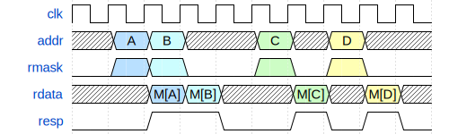
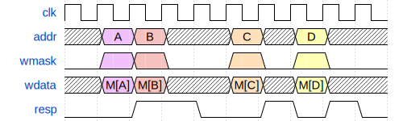
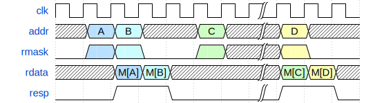
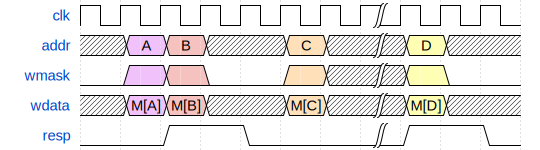
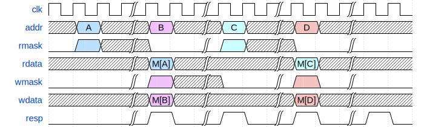

# ECE 411: mp_pipeline README

## Pipelined RV32I Processor

**This document, README.md, forms the specification for the machine
problem. For a more comprehensive summary, see [GUIDE.md](./GUIDE.md).**

# Design Specifications

  
  
Figure 1: Processor block diagram

You are required to implement a 5-stage pipelined processor that is RV32I
compliant with the exception of `FENCE*`, `ECALL`, `EBREAK`, and `CSRR*` instructions.

The specification of the RV32I ISA can be found here:
[The RISC-V Instruction Set Manual](https://riscv.org/wp-content/uploads/2017/05/riscv-spec-v2.2.pdf).
You will implement every instruction listed in Chapter 2 up to and including Section 2.6.
You can also find all the instructions listed in Chapter 19.

Your CPU only needs to support naturally aligned load and stores (described in Section 2.6 of the RISC-V ISA Manual).

Your processor must have all possible hazard resolutions implemented and have no unnecessary stalls.

Your CPU must only expose two memory ports: one for instruction memory, and one for data memory.
These signals are listed in the provided file `hdl/cpu.sv`.

The two memory ports must have the following timing characteristics:

  
  
Figure 2: Read without stalling

  
  
Figure 3: Write without stalling

  
  
Figure 4: Mixed read and write without stalling

  
  
Figure 5: Read with stalling

  
  
Figure 6: Write with stalling

  
  
Figure 7: Mixed read and write with stalling

Requests made on the two memory interfaces need to be 32-bit aligned.
Memory read and write cannot be simultaneously asserted.
The two memory ports cannot access the same address simultaneously.

The program counter in your CPU should reset to `0x1eceb000`.

You are required to connect RVFI to your design. To do so,
you must populate the file `hvl/common/rvfi_reference.json` with hierarchical
references to the required signals.

# Grading

## Submission
You will be graded on the files on the `main` branch in your class GitHub repository on the specified deadline.

Files you will be graded on:
- `hdl/*.sv`: You are free to add more files in this directory.
- `pkg/types.sv`
- `hvl/common/rvfi_reference.json`
- `options.json`

All other files will be replaced by the autograder.

In any graded SystemVerilog file, you must not call non-synthesizable SystemVerilog system tasks.
The string for a system task call (for example, `$display`, `$error`) also must not appear in any
comments. If you would still like to leave references to these functions as comments,
you must remove the '$' preceding the function name to remain eligible for an autograder run.

Only alpha-numerical characters, `.`, and `_` are allowed inside the 'to be filled out' section in `hvl/common/rvfi_reference.json`.

## Checkpoints
This MP will be partitioned into three checkpoints.

- **CP1**: You are expected to have all required instructions working,
  with the exception of branches, jumps, and memory instructions (loads and stores).
  You are not required to handle pipeline hazards (our test cases will place `nop`s between dependent instructions).
  The design will also use the ideal next-cycle response memory module
  (`MAGIC=1` for `n_port_pipeline_memory_32_w_mask.sv`) which never stalls.
  The provided code already has this memory model enabled.
- **CP2**: You will extend your CP1 CPU to work with a more realistic memory model
  that responds in a variable number of cycles (`MAGIC=0` for `n_port_pipeline_memory_32_w_mask.sv`).
  You must swap to the memory model by changing the `MAGIC` parameter to
  `n_port_pipeline_memory_32_w_mask` in `top_tb.sv`.
  In addition, you need to now support memory instructions (loads and stores).
- **CP3**: The remaining instructions (branches, jumps) are to be implemented in addition to the hazard detection
  and resolution logic. This includes data forwarding to combat data hazards and flushing the pipeline in the event of control hazards.
  The memory model remains unchanged from CP2.

| Checkpoint | Control Inst | Hazards | Load & Store | Mem. resp Delay |
|------------|--------------|---------|--------------|-----------------|
| CP1        | No           | No      | No           | Next-cycle      |
| CP2        | No           | No      | Yes          | Variable cycle  |
| CP3        | Yes          | Yes     | Yes          | Variable cycle  |

## Grading
Points will be assigned for individual instruction functionality, as well as longer tests. The final point breakdown is as follows:

| CP   | Pts |
|------|-----|
| CP1  | 10  |
| CP2  | 10  |
| CP3  | 80  |

For CP1, the point breakdown is as follows:

|     Test         | Pts |
|------------------|-----|
| Targeted Tests   | 5   |
| Random Testbench | 5   |

For CP2, the point breakdown is as follows:

|     Test         | Pts |
|------------------|-----|
| Targeted Tests   | 5   |
| Random Testbench | 5   |

For CP3, the point breakdown is as follows:

|     Test         | Pts |
|------------------|-----|
| Targeted Tests   | 60  |
| Random Testbench | 10  |
| CoreMark         | 10  |

- **Targeted Tests**: Targeted tests consist of multiple test cases where each aims to test one instruction
  or one hazard extensively.
  A detailed breakdown within the targeted tests will be included in the deadline AG report.
- **Random Testbench**: We will run your CPU using our random testbench for a extensive amount of time. This testbench is
  akin to the constrained random testbench you wrote for part 3 of `mp_verif`, so we recommend utilizing that code!
- **CoreMark**: CoreMark is a microprocessor benchmark program which runs a large set of RV32I instructions.

Failure to satisfy these requirements will result in a 0 on checkpoint 1:
- IPC when running long code with no memory or control instructions and no data hazards >= 0.99

Failure to satisfy these requirements will result in a 0 on checkpoint 2:
- IPC when running long code with no control instructions and no data hazards
  with `MAGIC=1` for `n_port_pipeline_memory_32_w_mask.sv` >= 0.99

Failure to satisfy these requirements will result in a 0 on checkpoint 3:
- IPC when running long code with no control instructions and no use after load hazard
  with `MAGIC=1` for `n_port_pipeline_memory_32_w_mask.sv` >= 0.99

Failure to satisfy these requirements at checkpoint 3 will result in an exponential deduction on your checkpoint 3 score:
- Area <= 20,000 μm2 with half-life of 1,000μm2
- Clock period <= 2ns (500MHz clock frequency) with half-life of 0.1ns
- IPC when running CoreMark with `MAGIC=1` for `n_port_pipeline_memory_32_w_mask.sv` >= 0.6 with half-life of 0.02

Which is to say, your score at checkpoint 3 (before applying warning penalty) will be given by:

$$ \text{CP3 raw score} \times 2^{\frac{20,000\mu m^2 - \max(20,000\mu m^2, Area)}{1,000\mu m^2}} \times 2^{\frac{WNS}{0.1 ns}} \times 2^{\frac{\min(0.6, IPC)-0.6}{0.02}} $$

If your design contains any errors from lint/compile/synthesis, your score for the corresponding checkpoint will be a 0.

Lint/compile/synthesis warnings are allowed in CP1 and do not lead to score deductions.

If your design contains any warnings from lint/compile/synthesis, your score at CP2 and/or CP3 will be (further) multiplied by 0.8.
