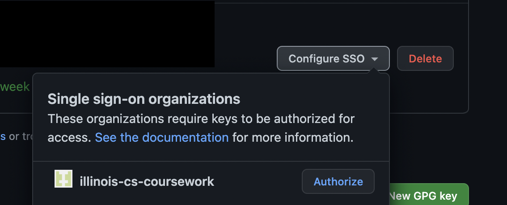
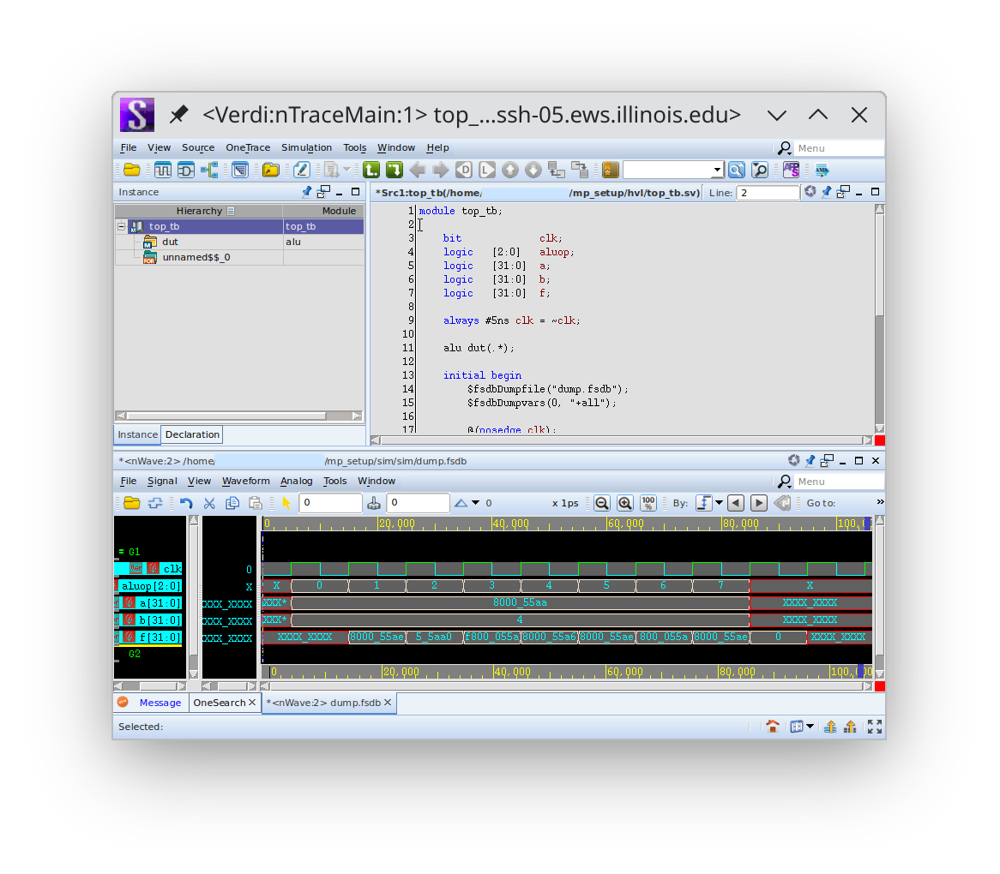
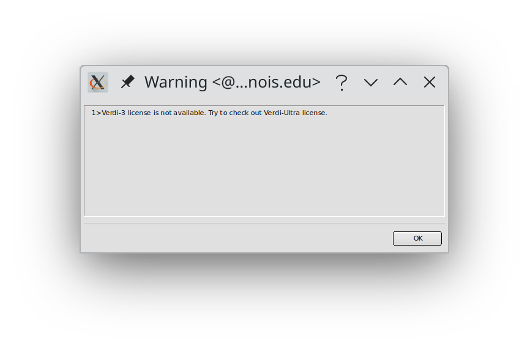

# ECE 411: mp_setup Documentation

Welcome to ECE 411! In this MP, you will set up your environment for the coming MPs this semester.
This document will go over how you can work on this course's MPs remotely by connecting to EWS.

# Environment Setup

We are using the Synopsys toolchain for all MPs in this course. These tools are not available to be
setup on your own machine. You will need to use EWS to access these tools.

You have two options for your remote work environment setup: FastX or SSH with X-Forwarding.
Once you are able to connect remotely to an EWS machine you can move on to the next section.

FastX pros:

- Easy to setup
- Higher framerate
- Even works in browser
- Works well under network with high latency and/or low bandwidth
- Usually performs better than SSH with X-Forwarding

SSH with X-Forwarding pros:

- Sharper image, native resolution
- Sometimes performs better than FastX if you are using Linux

If you prefer to do not work remotely, you can visit any campus
[Linux EWS Lab](https://answers.uillinois.edu/illinois.engineering/page.php?id=104731).

## FastX

EWS has a remote X desktop set up for students. There are two ways to access FastX: either through a web
browser at **fastx.ews.illinois.edu** or by downloading a client and connecting to FastX through there.
The instructions and download for the client can be found [here](https://answers.uillinois.edu/illinois.engineering/81727).
If you have issues with FastX, please contact engineering IT by means listed [here](https://engrit.illinois.edu/contact-us).

## SSH with X-Forwarding

EWS has set up a couple of servers that students can access over SSH. You can reach these using your favorite
SSH client by connecting to the EWS SSH server **linux.ews.illinois.edu**.

Almost all students have found that having a graphical waveform viewer (Verdi) useful. You may be the same,
in which case you may want to set up X-forwarding. Many SSH clients already include a built-in local X server. Some SSH
clients, however, require installing and configuring a local X server separately.

If you are using X-forwarding, please turn on compression (option `-C` in command line) in SSH, as X-forwarding
requires huge amount of bandwidth for graphical application. In real practice, SSH compression can reduce a huge
fraction of bandwidth use (~300 Mbps to ~10 Mbps from our experiences).

### Windows

Here are some SSH clients, X servers, and tools on Windows:

- MobaXterm (SSH client with built-in X server)
- PuTTY (SSH client)
- SecureCRT (SSH client)
- Xming (X server)
- WinSCP (File management for FTP, SFTP, SSH)

We recommend using MobaXterm, as installation is simple and it already includes a built-in X server. If you would
like to use MobaXterm as your SSH client, follow these instructions.

Navigate [here](https://mobaxterm.mobatek.net/download-home-edition.html) and follow the instructions to download and
install MobaXterm.

You can create a saved session by clicking `session` on the menu bar, then select `SSH`.

- In `Remote host`, input `linux.ews.illinois.edu`
- In `Username`, input your NetID
- In `Advanced Settings`, enable X-Forwarding and compression.
- Optionally, supply SSH private key here, detailed in the next section.

Once you are done, you will find this saved session on the side bar. Double click on it to connect.

### Mac

SSH client comes built in in Mac, however, you need to install X-server separately.
We recommend using XQuartz as your local X-server. You can download and install XQuartz [here](https://www.xquartz.org/).

Once installed, start the application XQuartz and open a terminal by selecting Applications -> Terminal.
You can also use MacOS's own terminal.

Now, you can SSH into EWS by running (replacing `NETID` with your NETID):

```
$ ssh -CY NETID@linux.ews.illinois.edu
```

`-X` or `-Y` enables X-forwarding and `-C` turns on compression for X-forwarding.
After that, you should be connected to EWS with X-forwarding enabled.

### Linux and WSL

Make sure you have a X-server running, and simply run (replacing `NETID` with your NETID):

```
$ ssh -CY NETID@linux.ews.illinois.edu
```

And it should be good to go now.

You can read about the difference between `-X` and `-Y` [here](https://man7.org/linux/man-pages/man1/ssh.1.html).
We have observed that some features of Verdi such as zooming the wave window using mouse wheels might not work
if using untrusted X-Forwarding (`-X`). Please consider using trusted X-Forwarding (`-Y`) if you encounter those issues.

## SSH with Keys

Tired of having to type your password every time you SSH? Here is how you can enable PubKey authentication on SSH.

**It is worth noting that the ssh private key is basically your password. Keep it safe and do not share it!!**

### MobaXterm

- On the menu bar, select Tools -> MobaKeygen
- We recommend using EdDSA -> ED25519
- Click Generate
- Save PuTTY formate private key to somewhere safe
- Record the public key
- In the session settings, select saved private key file in advanced setting menu.
- SSH onto EWS, and use your favorite text editor to put the public key into `~/.ssh/authorized_keys`
- Make sure to `chmod 700 ~/.ssh` and `chmod 600 ~/.ssh/authorized_keys`.

### Mac, Linux and WSL

- Run `ssh-keygen -t ed25519`
- Read the Public key from `~/.ssh/id_ed25519.pub`
- SSH onto EWS, and use your favorite text editor to put the public key into `~/.ssh/authorized_keys`
- Make sure to `chmod 700 ~/.ssh` and `chmod 600 ~/.ssh/authorized_keys`.

### VSCode (with Remote-SSH Plugin) on Windows

- Generate ssh keys, either:
  - Follow steps above for MobaXterm
    - It is OK to re-use key generated for your MobaXterm SSH Session
    - During saving private key, select Conversion -> Export OpenSSH Key
  - Follow steps above for Mac, Linux and WSL
- Save OpenSSH format private key to `C:\Users\[Your User Name]\.ssh\id_ed25519`

# Creating the Github Repository

## SSH Key

We highly recommend setting up public key authentication with GitHub so you do not have to type your password every time you commit your code.

Note that this is a different key from the one in the previous section. Both are SSH keys used in SSH authentication,
However, the last one is used to authenticate your own machine with EWS, and this one is to authenticate EWS with GitHub.
We do not recommend re-using SSH keys.

You can create a public key for your SSH client by running the following on EWS:

```
$ ssh-keygen -t ed25519
> Enter a file in which to save the key (~/.ssh/id_ed25519): [press enter]
> Enter passphrase (empty for no passphrase): [type passphrase, or leave empty and press enter.]
> Enter same passphrase again: [type same passphrase again]
$ eval "$(ssh-agent -s)"
$ ssh-add ~/.ssh/id_ed25519
```

Print your public key to the terminal so you can copy it and add it to your Github:

```
$ cat ~/.ssh/id_ed25519.pub
```

Navigate [here](https://github.com/settings/keys) and you should see the following web page:


Figure 1: SSH and GPG keys

Select **New SSH Key** and type in a descriptive title. Paste your copied public key into the **key** field:


Figure 2: Enter your new SSH key.

Click **Add SSH key** and type in your GitHub password if prompted.


Figure 3: Authorize Illinois coursework.

Click on configure SSO and authorize illinois-cs-coursework.

## Illinois CS Network GitHub Repository

To create your Git repository, go to https://edu.cs.illinois.edu/create-gh-repo/fa24_ece411.
The page will guide you through the setup of connecting your github.com account and your Illinois NetID.
You will need a github.com account in order to create the course repository. Please follow all the instructions on the link above.

Next, create a directory to contain your ECE 411 files (this will include subdirectories for each
MP, so chose a name such as `ece411`) and execute the following commands (replacing `NETID` with
your NetID):

```
$ mkdir ece411
$ cd ece411
$ git init
$ git remote add origin git@github.com:illinois-cs-coursework/fa24_ece411_NETID.git
$ git remote add release git@github.com:illinois-cs-coursework/fa24_ece411_.release.git
$ git pull origin main
$ git branch -m main
$ git fetch release
$ git cherry-pick <commit hash found on course website>
$ git push --set-upstream origin main
```

If you have not set up SSH access to your github account, you may encounter an error similar to the following figure.


Figure 4: Github SSH Error

# Testing Your Software

To setup the software and environment variables for this class, run the following command:

```
$ source /class/ece411/ece411.sh
```

You will need to run this command every time you log on to EWS. Alternatively you can add it to your bashrc:

```
$ echo 'source /class/ece411/ece411.sh' >> ~/.bashrc
```

## VCS

We use Synopsys VCS to simulate our designs in this course. After cloning mp_setup and setting up the class environment,
from the `sim` folder, run:

```
$ make vcs/top_tb
```

This will invoke the Synopsys VCS compiler, which build a simulation binary using the RTL design in `hdl` and the testbench in `hvl`.

During this, you might see a segmentation fault. This is known to be harmless and is safe to ignore.

Now proceed with:

```
$ make run_vcs_top_tb
```

This will run the simulation.
The simulation will dump all signals in a fast signal database (FSDB) file.

We recommend you open up and read the Makefile if you would like to know what exactly the two make target commands were doing.

## Verdi

Verdi is Synopsys's waveform viewer and debugger. We use it to inspect signals inside our design.
To view the signal dump from the simulation that you just ran:

```
$ make verdi
```


Figure 5: Verdi

You can navigate the design hierarchy on the instance window on the left. Double clicking on an instance opens up the block's code in the source browser window.
Select any signal name in the source browser window and press `Ctrl + 4` or `Ctrl + w` to add it to the waveform viewer.

While a signal is selected, you can click on the driver or load buttons on the toolbar (with D and L as their logos respectively) to go to the source or destination
of the selected signal.

If you changed your design and re-ran the simulation, you can reload the waveform by `Shift + L` without closing and reopening Verdi.

A complete user guide to Verdi can be found on EWS:

```
$ xdg-open $VERDI_HOME/doc/verdi.pdf
```

The following warning might show up when you launch Verdi. It is safe to ignore it.


Figure 6: Verdi license warning

Due to the limited amount of license we have for Verdi,
to prevent you from forgetting to close Verdi,
by default Verdi will close after 1 hour after been opened.

## Design Compiler

Synopsys Design Compiler is an RTL synthesis tool. A synthesis tool converts an RTL circuit specification into logic gates and flip-flops. It uses pieces available
in a standard cell library as building blocks. In ECE 411, we will use FreePDK45 as our target technology.
In the real world, the PDK or Process Design Kit is usually supplied by the foundry.

The synthesis tcl scripts have been set up for you.

To synthesize the mp_setup design, in the `synth` folder, run:

```
$ make synth
```

Generated reports, including area and timing, are in `synth/reports`.

The area report will be an estimate of how much physical space a design will occupy in square micrometers.
The timing report will show the longest path delay in the design and whether it meets the timing requirement
imposed by the target clock frequency.

You can open the GUI for Design Compiler, called Design Vision, by:

```
$ make dv
```

Due to the limited amount of license we have for Design Vision,
to prevent you from forgetting to close Design Vision,
by default Design Vision will close after 1 hour after been opened.

## Spyglass

Spyglass is the linting tool. It will look at your source RTL code and report any potential problems in your design.

To lint the mp_setup design, in the `lint` folder, run:

```
$ make lint
```

Generated reports are in `lint/reports`.

The main report to look at is `lint/reports/lint.rpt`. The specific report for this design should show no problems.

# Deliverables

There are no deliverables for this MP. However, it is essential that you go through the steps listed here
to setup your development environment and understand the tools being used.

We encourage you to look at the provided scripts and Makefile, and post any questions about the tools to Campuswire or Piazza.
