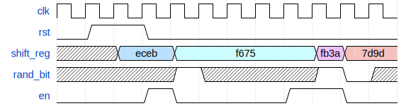
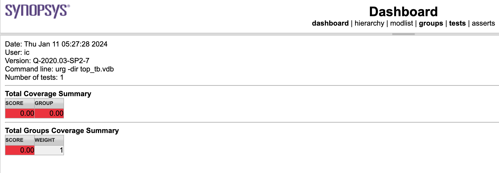
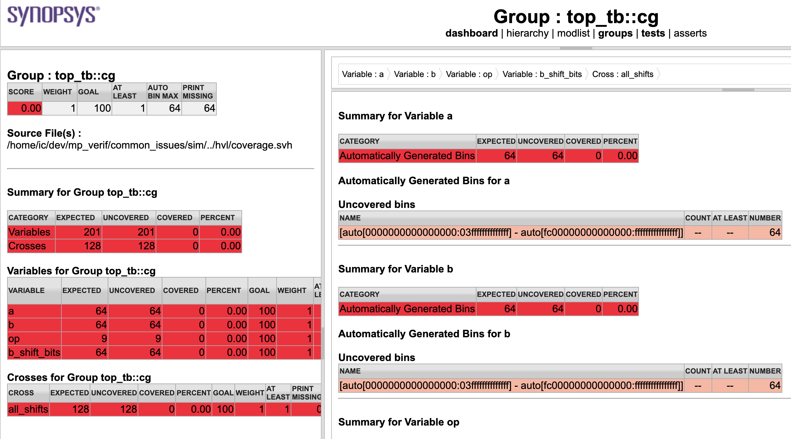
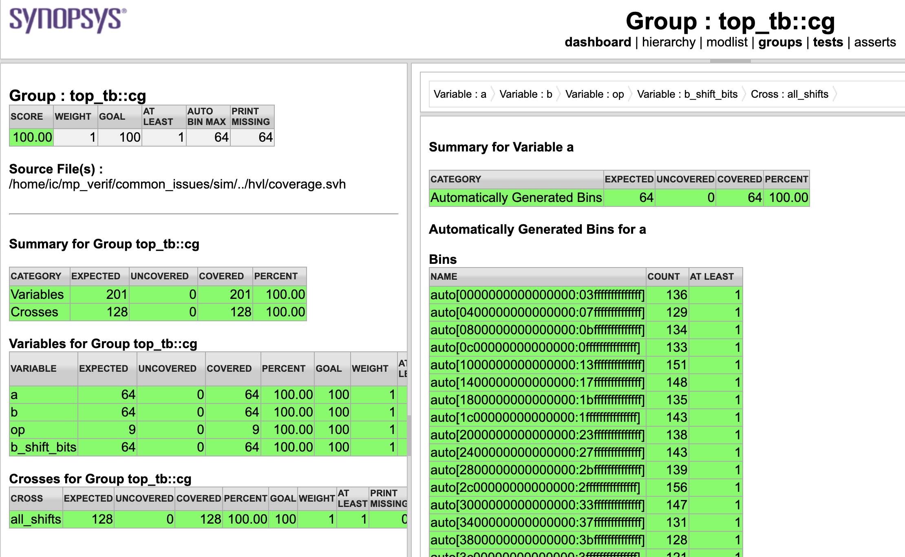
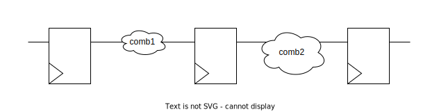
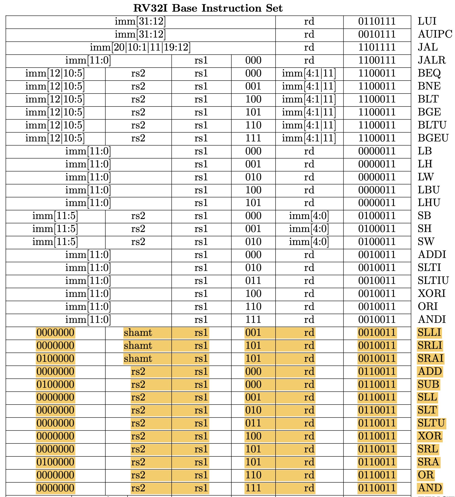

# ECE 411: mp_verif GUIDE

## Introduction to SystemVerilog and Verification

**This document, GUIDE.md, serves as a gentle, guided tour of the MP. For
strictly the specification and rubric, see [README.md](./README.md).**

It is highly recommended that you use the automatically generated
table of contents/outline to navigate this page, accessed by clicking
the "bullet points" icon on the top right of the markdown preview
pane.

# Introduction
Welcome to the first machine problem in ECE 411: Computer Organization
and Design! This MP assumes that you are familiar with basic RTL
design using SystemVerilog from ECE 385: Digital Systems Laboratory.
In this MP, you will learn some more advanced concepts in
SystemVerilog and verification. You will also become familiar with the
tools used in ECE 411, including the simulation, synthesis, and lint
programs. This MP is divided into four parts:

1. **SystemVerilog refresher:** You'll design a small module in
   SystemVerilog as a refresher, and to get familiar with the
   toolchain used in this class.
2. **Fixing common errors:** Logical errors, inferred latches, combinational
   loops, and long critical paths are common issues that RTL designers
   face. In this part of the MP, you will identify and fix these
   issues in a couple of simple designs.
3. **Constrained random and coverage:** Writing directed test vectors isn't a lot
   of fun, and often doesn't have good coverage. In this part, you'll
   learn how to use constrained random vector generation and coverage
   collection to better verify complex designs.
4. **Verification of a CPU:** Finally, a CPU! You will find
   bugs in a simple multicycle RISC-V CPU implementation by using your
   knowledge from parts 1-3.

# Part 1: SystemVerilog Refresher / LFSR

## On SystemVerilog
SystemVerilog is a hardware description language and a hardware verification
language. You've previously used SystemVerilog in ECE 385 to implement some
basic digital circuits on FPGAs. In ECE 411, we'll use SystemVerilog to design
more involved digital circuits. There are two primary "tasks" when describing
hardware in RTL ([register-transfer
level](https://en.wikipedia.org/wiki/Register-transfer_level)): **simulation**
and **synthesis**.
- Simulation means using a software program to mock the operation of the
  circuit to ensure functional correctness. ECE 411 uses an industry standard
  simulator: Synopsys VCS.
- Synthesis is the process of turning the RTL into gates and flip flops,
  typically done using a synthesis tool. In ECE 411, we will use Synopsys Design
  Compiler (DC) using the
  [FreePDK45](https://eda.ncsu.edu/freepdk/freepdk45/) process design kit.

In the first part of this MP, you will write an RTL design and put it
through both simulation and synthesis.

## Linear Feedback Shift Registers
The design you are required to implement is a **linear feedback shift
register** (LFSR). These are used to generate pseudorandom sequences
of bits cheaply in both hardware and software. Here's the block
diagram of the LFSR you will implement:


The 16-bit register is a shift register that shifts right. The bit
shifted in is the XOR of certain "tap bits", and the bit shifted out
is the random output. The location of the taps has been chosen such
that the period of the LFSR is maximum[^1] (that is, it cycles through all
$2^{16}$ possibilities before looping back to the initial state).

[^1]: To learn more about how to choose the tap locations to satisfy
    this property, take MATH 418 (Abstract Algebra II).

## Understanding the Implementation

The expected behavior waveform is:



Waveforms can tell us a lot about a circuit. First, notice that `rst`
is high for the first few cycles. After reset, the value of the shift
register is `0xeceb` -- this is the seed of the LFSR. Then, `en` is
pulsed for a clock cycle. The LFSR makes its transition, and the
output on `rand_bit` is the last bit of `0xeceb` that got shifted out.
You should verify, on paper, that `0xeceb -> 0xf675` is the correct
transition for the LFSR shown above. Also trace out the later
transitions, making sure you verify the values of `shift_reg` and
`rand_bit` on paper manually.

You might have noticed that `rand_bit` is shaded gray when it is not directly
after an `en` pulse. This notation means that the output of `rand_bit` is
don’t care, meaning that it can be any value. When don’t care is used in say
for example a input of your design, it means that the signal can take any value
and it should not affect the operation of your design.

## Running a Simulation

First, see the folder structure with:

```bash
$ cd lfsr
$ tree
```

You should see the output:

```
lfsr
├── hdl
│   └── lfsr.sv
├── hvl
│   └── vcs
│       └── top_tb.sv
├── lint
│   ├── check_lint_error.sh
│   ├── lint.awl
│   ├── lint.tcl
│   └── Makefile
├── sim
│   ├── check_compile_error.sh
│   ├── check_sim_error.sh
│   ├── check_sus.py
│   ├── Makefile
│   └── vcs_warn.config
└── synth
    ├── check_synth_error.sh
    ├── constraints.sdc
    ├── dc_warn.tcl
    ├── dv.tcl
    ├── get_area.sh
    ├── Makefile
    ├── synth-error-codes
    └── synthesis.tcl
```

This minimal folder structure will be the same across all designs in
ECE 411:
- `hdl` contains synthesizable RTL.
- `hvl` contains non-synthesizable testbenches used for simulation and
  verification.
- `lint` contains scripts to run lint on your design in `hdl`
- `sim` contains scripts to run simulation on your design in `hdl`
- `synth` contains scripts to run synthesis your design in `hdl`

For now, your LFSR design will go in `hdl/lfsr.sv`. For this part of the
MP, the testbench is provided fully implemented in `hvl/vcs/top_tb.sv`. In
the next part of this MP, these training wheels are removed and you
will write both the RTL and testbench. Once you implement some RTL in
`hdl/lfsr.sv`, run the testbench in simulation with:

```bash
$ cd sim
$ make vcs/top_tb
$ make run_vcs_top_tb
```

This should run VCS on your design, which generates a compiled simulation binary,
then run the compiled binary. You will see a pass/fail result printed by the testbench.
Now, pull up Verdi (the waveform viewer), with:

```bash
$ make verdi &
```

Verdi is a large, complex program that deserves much explanation.
However, getting started is easy: in the source browser, click on any
signal that you want to look at (start with `clk`), then press
`Ctrl-W` (or `Ctrl-4` if you are using FastX).
The signal will be shown in the waveform. Verdi is
discoverable and rather intuitive: click around to see what you can
do. If the testbench told you there is a failure, track it down by using the
timestamp printed in the error message.
The time unit used throughout ECE411 will be picoseconds.
Once you see the bug, fix your RTL, rerun the
simulation, then reload the waveform in Verdi with `Shift-L`.

## Running Lint
It is very useful to run lint after HDL changes.
The linter will statically analyze your code for some possible issues.
To run lint:

```bash
$ cd lint
$ make lint
```

You can check your report in `lint/reports/lint.rpt`.
If there is any issue, a short explanation will be provided on the same line with the issue.
For ECE411, we require that you pass the provided lint without any error or warning.

## Running Synthesis

After $n$ Verdi debug cycles, you should pass simulation. It's time to
see if your design can actually be turned into gates to be put on a
chip or FPGA. To run synthesis, do:

```bash
$ cd synth
$ make synth
```

Once synthesis finishes running (and you get the "Synthesis
Successful" text), check out the reports in `synth/reports`. The two
of primary interest are `timing.rpt` and `area.rpt`. There are no area
limits in this MP, but meeting timing is important. Informally,
"meeting timing" means that your circuit can successfully run at the
specified clock frequency (in this case, 1GHz). We will talk more
about timing in the next part. For now, make sure that your LFSR passes
timing (the slack is a positive number).

## Hints

Recall the SystemVerilog concatenation operator (`{}`) can be used to
implement a left shift register in the following way:

```systemverilog
// Recall: always_ff @(posedge clk) implements positive-edge clocked D flip flops
always_ff @(posedge clk) begin
    shift_reg <= {shift_reg, shift_in};
end
```

Note that the top bit of the right hand side is discarded when
assigning back to `shift_reg`. How would you change this to implement
a right-shift register? How would you compute the bit that's shifted
in?

It is also worth noting that the concatenation operator can be used
on the left hand side of a assignment as well:

```systemverilog
always_ff @(posedge clk) begin
    {a, b} <= {b, a};
end
```

# Part 2: Fixing Common Errors

## On Common Errors
While designing a digital circuit, various types of "bugs" can creep
in. Here are some common ones we've seen in past semesters:
- **Logical/functional errors**: A design has incorrect functionality. For
  instance, it raises a signal that shouldn't be raised.
- **Accidentally inferred latches**: When defining combinational
  logic, if not every case is written down, SystemVerilog infers a
  memory element called a latch. This is usually not intentional.
- **Combinational loops**: Explained in the next section.
- **Long critical paths**: Due to circuit timing characteristics, only
  a certain amount of combinational delay can happen in a single clock
  cycle. Too much combinational logic between FFs can cause timing to
  "fail". The path with the longest delay is called the "critical
  path" of the design.

## Part 2.1: ALU

In this exercise, we provide an ALU design that suffers from the first
two of these bugs, and your task is to fix these bugs. Combinational
loops and timing are split into a separate exercise that you'll do next.

When looking at an unfamiliar SystemVerilog module, the most useful
thing to look at is often the port list/interface:

``` systemverilog
module alu (
    input   logic           clk,
    input   logic   [2:0]   aluop,
    input   logic   [31:0]  a, b,
    input   logic           valid_i,
    output  logic   [31:0]  f,
    output  logic           valid_o
);
```

What does this interface tell us?
- The ALU has a clock input `clk`.
- The ALU has two 32-bit inputs, `a` and `b`.
- The operation is selected using a 3-bit code called `aluop`.
- The ALU responds with `f`, a 32-bit result.
- The ALU has the capability to pass a "valid" signal.

This information is gleaned from the naming of the signals and the
comments. Since the ALU is such a simple design, the only other bit of
information we need is the `op` code encodings:

| Operation | `op` Code |
| --- | --- |
| Bitwise AND | 0 |
| Bitwise OR  | 1 |
| Bitwise NOT | 2 |
| Add | 3 |
| Subtract | 4 |
| Left shift | 5 |
| Right shift | 6 |

Some of these are unary operations (they only require one input, like
bitwise NOT) -- these are defined to act on input `a` and
ignore input `b`.

## Issues with `hdl/alu.sv`

The data above is enough to write a very quick implementation of the
ALU, as provided in `hdl/alu.sv`. However, this design has bugs, as
discussed earlier. Of course, you could completely remove the contents
of the module and write it from scratch, but it's much more
instructive and useful for future MPs if you learn to fix the issues
in the given design.

### Inferred Latches

Latches are inferred in SystemVerilog if you have an `always_comb`
block that holds a value across evaluations. For instance, in the case
of a 3:1 MUX,

```systemverilog
always_comb begin
    case (sel)
        2'b00: out = a;
        2'b01: out = b;
        2'b10: out = c;
    endcase
end
```

This will infer a latch. Imagine a case where the block is evaluated
at `sel == 2'b01` and `out` is assigned to a. Then `sel` changes to
`2'b11`. What is `out` now?

The correct answer according to SystemVerilog semantics is that it
holds its previous value, thus inferring a memory element,
specifically, a latch. To ensure you're not inferring memory elements
in your combinational logic, ensure that your outputs are assigned a
value for every evaluation path (i.e., they never have to implicitly
hold the value from the previous evaluation).

Here's a couple of ways to fix the latch in the above example:
```systemverilog
always_comb begin
    out = 'x;
    case (sel)
        2'b00: out = a;
        2'b01: out = b;
        2'b10: out = c;
    endcase
end
```

Alternately, (we highly recommend this method):

```systemverilog
always_comb begin
    unique case (sel)
        2'b00: out = a;
        2'b01: out = b;
        2'b10: out = c;
        default: out = 'x;
    endcase
end
```

There are cases when only adding a `default` to your case statement
isn't sufficient: you need to ensure that all of the possible
evaluation (control) paths assign a value to the variable.

Finding latches is easy: you can run either lint or synthesis.
Our synthesis flow disallows inferred latches, and will report it as
an error:

```bash
$ cd synth
$ make synth
```

Reading `reports/synthesis.log` will tell you which variables in the
ALU became inferred latches.

```bash
$ cd lint
$ make lint
```

Reading `reports/lint.rpt` will tell you which variables in the
ALU became inferred latches.

### Logical/Functional Errors

These are the most common class of real "errors", and are found by
writing testbenches for verification. You wrote some simple
testbenches in ECE 385, and in ECE 411 you'll use more powerful
techniques to write high-quality SystemVerilog testbenches.
Verification is a very large part of digital design, and many
ASIC/FPGA interviews you'll get right out of college will be for
verification roles.

Part of the testbench for the ALU has been provided at
`hvl/vcs/top_tb.sv`. You should first read through this file to make sure
you understand everything that's going on. If there are any
SystemVerilog keywords that you're unfamiliar with, you should look
them up (or ask a TA!) to make sure you have a solid understanding of
how to write a basic testbench. This testbench includes the file `hvl/vcs/verify.svh`,
in which there are a number of incomplete `TODO`s -- work through them in order
until you are able to fix the functional errors in the provided ALU.

Finally, your testbench must have 100% "coverage". Coverage is a way
to measure whether you've tested your design thoroughly enough. For a
combinational design with $n$ inputs, to test every input, you need
to try $2^n$ possible input combinations. This isn't feasible for a
somewhat large $n$. (What is $n$ for the ALU?) Thus, the testbench
sends in some subset of possible test vectors to the DUT (design under
test). Coverage is a way of measuring that these vectors tested enough
interesting cases. In essence, coverage is "statistics collection" on
your input test vectors.

The coverage for this part of the MP has been
written for you, and is in `hvl/vcs/coverage.svh`. For you to get full
credit on your testbench, you must sample this covergroup every time
you generate a transaction. At the end of the simulation, your
coverage must be 100%. It's important to learn to view the coverage
report to see what coverage you're missing. To do this, run:

```bash
$ cd sim
$ make run_vcs_top_tb    # Uses the testbench in hvl/vcs/top_tb.sv
$ make covrep            # Generate the coverage report in vcs/urgReport/dashboard.html
```

To actually open the HTML file, you have three choices:

- Use your favorite file transfer tool to download the report onto
  your local computer and open it there.
- If you're on FastX/X-forwarding or in person at the lab:
  ```bash
  $ firefox vcs/urgReport/dashboard.html
  ```
- If you're on SSH and prefer to use your local web browser, on your
  local shell, do:
  ```bash
  $ ssh -L 8000:localhost:8000 netid@linux.ews.illinois.edu
  ```
  Then, on EWS, navigate to `mp_verif/alu/sim/vcs/urgReport`,
  and do:
  ```bash
  $ python3 -m http.server 8000 &
  ```
  Now, on your local machine, navigate to
  http://localhost:8000/dashboard.html, and you should see the
  coverage report.

The coverage report looks like the following (if you haven't sampled
the covergroup at all):



In the navbar, click on "Groups", then on "top_tb::cg" in the second
table on the page. You should see a detailed breakdown of each
coverpoint in the covergroup (at this point, none will be covered):



As you feed more stimulus into the DUT and sample the covergroup, your
coverage will go up. Rerun `make run_vcs_top_tb && make covrep`, then
reload the page to see the updated coverage. The page should look like
this:



If you see this, you're done writing the testbench!

## Part 2.2: Combinational Loops

This design has three modules:

- `foo.sv`: A module with a down-counter that generates the `ack` pulse
  when its counter matches an input value and `req` is high.
- `bar.sv`: A module with an up-counter that sends its value along with
  a `req` signal to `a`, to generate the `ack` pulse.
- `loop.sv`: Top level module connecting the two.

Another common issue that might arise in your ECE 411 journey is a
combinational loop. This is, when you have some combinational logic
where the input depends on its own output. In ECE 120, flip-flops are
implemented using a similar kind of combinational logic. Specifically,
they are stable loops, wherein the value generated is guaranteed to converge
to a single stable value within some timeframe after a change in input. However,
in ECE 411 we think at a higher level of abstraction, so flip-flops are simply a
primitive in our tool-chain. For the purposes of this course, you will not
(and should not) write any combinational loops, stable or not.

In this exercise, you will debug a given design that has a very
obvious loop. This exercise is more about how to use the provided
tools to find it.

One telltale sign of a non-stable combinational loop is an indefinitely
hanging simulation, where no matter how long you wait before
you press `Ctrl-C`, the simulated time is always stuck at the exact same value.
This is because there are cyclic dependencies in the sensitivity lists
of multiple `always` blocks. Thus, the simulator is never able to progress
to the next timestep.

Both lint and synthesis can tell you where the loop is.

Lint will tell you where the loop is, using signal names from your RTL.
Simply run lint and check `lint/reports/CombLoopReport.rpt`.
At the bottom of the report file, you should see a series of statements
indicating each signal that has a combinational loop. For each loop,
the table lets you know which file to look at, the line number in that file,
and also the various signals/variables in the loop. Each of the items separated by a
`-` represents one step in the loop. Note that this report includes multiple submodules.
The report utilizes the `.` operator to indicate some piece of information is inside of
(a member of) something else. For example, you might see `top_module.submodule.signal`.

Synthesis will tell you there is a loop both on the console and in
`synth/reports/synthesis.log`. You might have noticed that the loop is
shown using some obfuscated names. This is because synthesis has already translated your
Verilog into gates, and those are randomly generated unique names for each gate.
It is possible to link those gates back to your code in Design Vision after you
have done synthesis:

```bash
$ make dv
```

By default, the right hand side of the main window will list all the cells in your design
organized by hierarchy.

- Find the line in `reports/synthesis.log` that shows you the loop
- In the Cells tab in DV, navigate the hierarchy and find the cell of interest
- Right click on the cell, and select "Cross Probe to Source"

The line highlighted with the red arrow is the line that result in this logic gate.

Repeat these step for all cells in the loop until you get the sense of where the loop is.

The goal of this exercise is to fix the loop. The testbench specifies
what the end result should look like. Any modification that will pass
the testbench constitutes a pass. However, we recommend you find the
loop and fix it instead of doing testcase oriented programming.

## Part 2.3: Timing / Tree

Meeting a high clock frequency is often a desirable goal for digital
designers. However, a circuit cannot be run at an arbitrarily high
clock speed, as there are constraints for timing that must be met.

First, a quick recap of ECE 385. Gates have parasitic
capacitance and it takes time to charge and discharge them. Flip-flops
have two requirements: input data needs to be correct a certain time
before the clock edge, called the **setup time**, and data needs to be held
at the correct value for a certain time after the clock edge, called the **hold time**.
This delay plus the combinational delay together means that the circuit
can only operate up to certain frequency, otherwise the data captured
by the flip-flop might be incorrect. The actual equations are:

$$t_{setup} + t_{comb} + t_{cq} \leq T_{clk}$$

$$t_{cq} + t_{comb} \geq t_{hold}$$

where $t_{setup}$ is the setup time, $t_{hold}$ is the hold time,
$t_{comb}$ is the delay of the combinational logic, $t_{cq}$ is the
clock-to-Q delay of the flip-flop, and $T_{clk}$ is the time period of
the clock. The first inequality (setup time equation) is of interest, since it
determines the maximum clock frequency. We would like to minimize
$T_{clk}$, therefore we want to minimize the left hand side of that
equation. The factor most in your control as an RTL designer is
$t_{comb}$ -- that is, the combinational delay between two flip flops.
Graphically,



In this case, the `comb2` stage has more delay than the `comb1` stage,
and therefore is the "critical path" of the design -- it is the path
that is limiting the clock frequency. To optimize a circuit for a
higher clock speed, a critical path is the first one you try to
optimize. Once you have, a new path may become the critical path, but
likely the circuit can meet higher clock speed now. A good goal as a
digital design engineer is to have "balanced" amounts of combinational
delay in each stage and each path.

You would definitely like to know where your critical path is, so that
you can have some idea of how to improve it. Once you run synthesis,
a timing report will be generated at `reports/timing.rpt`.
You are "meeting timing" if the slack number at the bottom is positive.
However, this report is not otherwise very human readable.

You can use Design Vision to gain more human readable insight into your design.

It would be great if we can visualize our design. Although it will be less
comprehensible in future MPs due to increased complexity, for this exercise:

- Select "tree" in local hierarchy
- On the menu bar, Schematic -> New Schematic View
- Double click on the "tree" white box in on the screen to expand the schematic

You can also view the critical path in Design Vision:

- On the menu bar, Timing -> Path Slack
- Leave everything at default, click OK
- Select the left most column on the histogram
- Right click on the first "path" on the right hand side, select "Path Inspector"
- Resize the columns so that you can see the names

To link those gates back to your code:

- Right click on the cell that you want to link back to your code
- Select "Cross Probe to Source"

The line highlighted with the red arrow is the line that synthesized to that logic gate.

You can also show only part of the design in the critical path by invoking schematic here:

- Right click on the cell that you want to link back to your code
- Select "Path Schematic"
- You can expand this partial schematic by double clicking on any gates

We find mentally visualizing (or drawing on scratch paper) the critical path in schematic form
helps with coming up with optimizations for that path.

For this exercise, the solution should be very obvious by viewing the whole schematic:
move the middle register one logic level earlier. This does not change the functionality
of the design, but it will improve the critical path, potentially at the cost of more registers being used.
This technique of moving part of the combinational logic across registers is called **retiming**.
For future MPs, you will be given the option to tell synthesis tools to apply retiming automatically
on your design, at the cost of higher area, power, synthesis time and post synthesis netlist debuggability.

# Part 3: Constrained Random and Coverage

## Constrained Random
As discussed earlier, a design with $n$ binary inputs has $2^n$
possible input combinations. However, not all of these $2^n$ may be
valid inputs to the DUT. For example, for the ALU provided in
`alu`, `op` cannot actually take on all its possible values.
Now, if we want to **randomly generate valid inputs** to the ALU, we
cannot simply pick any random 3-bit number. Instead, we must
"constrain" the randomness to be only the valid 3-bit numbers for
`op`. This can be done in SystemVerilog with "Constrained random value
generation", and is an extremely powerful technique. Here is what a
class that generates valid `op` values looks like:

```systemverilog
class RandOp;
  rand bit [2:0] op;

  constraint op_valid_c {
    op < 3'd7;
  }

endclass : RandOp
```

The constraint should be self-explanatory. Variables qualified with
`rand` must be class members. Having a `rand` variable automatically
defines a `randomize()` method on the class. So, to actually get a
valid `op` value, you would do:

```systemverilog
RandOp rop = new();

initial begin
  rop.randomize();
  $display("Got new random op: %x", rop.op);
  rop.randomize();
  $display("Got new random op: %x", rop.op);
  // ... and so on
end
```

Clearly, the idea of constraints is very general. There are many cases
where only a subset of inputs is actually valid. Constrained random
can be used to generate packets of certain formats, or valid
instructions for a CPU. This is your task: you must complete the
random class in `hvl/vcs/randinst.svh` called `RandInst` to randomly
generate valid RISC-V instructions. You will likely find the types
defined in `pkg/types.sv` extremely useful when writing the random
constraints. The best reference for this part is Chapter 19
RV32/64G Instruction Set Listings of the [RISC-V 2.2
Specification](https://riscv.org/wp-content/uploads/2017/05/riscv-spec-v2.2.pdf).
A constraint will be required wherever Table 19.2 (the RV32I
subsection) lists hardcoded binary values, since that dictates the
subspace of valid instruction vectors.
We strongly recommend you that read Chapter 2 of the
specification as well, because it provides a detailed explanation of
what exactly each instruction does. This is useful for understanding RISC-V
as well as for the last part of the MP.

## Functional Coverage
You've used functional coverage reports while writing the ALU to make
sure that your directed test vectors had enough coverage. Now, you
will write the SystemVerilog to evaluate the coverage of your random
constraints. Take a look at `hvl/vcs/instr_cg.svh`. The first few
coverpoints are simple enough to implement. The "cross coverpoints"
are trickier, and this section explains how to reason about them. What
we want to do is ensure that every row in the following table is
covered at least once:



Now, consider trying to cover all instructions that use `funct7`.
Clearly, that is the bottom 13 rows of the table. To actually put
these 13 "bins" into the coverage report, in SystemVerilog, we need to
use "cross coverage". The way we do this is that we first take a cross
product of three fields:

```systemverilog
funct7_cross : cross instr.r_type.opcode, instr.r_type.funct3, instr.r_type.funct7 {
```

This means we want to cover a triple cross product: every possible
opcode (9 possibilities), with every possible `funct3` (8
possibilities), with every possible `funct7` (128 possibilities). The
cardinality of this cross product is 9144: that is, there are 9144
3-tuples that this cross product generates. Of these, we only
care about 13. For example, we do care about the 3-tuple (op=0110011,
funct3=111, funct7=0000000) which represents the AND instruction. So, we need to
ignore a lot of the cross product in our coverage report. This can be
done with `ignore_bins`, like this:

```systemverilog
    // Cross coverage for funct7.
    funct7_cross : cross instr.r_type.opcode, instr.r_type.funct3, instr.r_type.funct7 {

        // No opcodes except op_b_reg and op_b_imm use funct7, so ignore the rest.
        ignore_bins OTHER_INSTS = funct7_cross with
        (!(instr.r_type.opcode inside {op_b_reg, op_b_imm}));
    }
```

The `ignore_bins` above says, ignore all members of the cross product
whose opcode is not either `op_b_reg` or `op_b_imm`. This makes sense if
you look at the 13 possibilities we want to preserve. The cardinality
of the cross product has now reduced to $2\times 8\times 128 = 2048$.
Your task, both with `funct7_cross` and `funct3_cross` is to add more
`ignore_bins` that ignore members of the cross product that aren't in
the table above. Note that `funct3_cross` is expected to have 31 bins,
corresponding to all rows of the table above (instructions) that have
a true `funct3` field (ignoring `funct7` differences).

## Solve Order
In `RandInst`, there is a constraint:
```systemverilog
rand instr_t instr;
rand bit [NUM_TYPES-1:0] instr_type;
constraint solve_order_c { solve instr_type before instr; }
```

In general,
> The solver shall assure that the random values are selected to give
> a uniform value distribution over legal value combinations (that is,
> all combinations of legal values have the same
> probability of being the solution).
> (IEEE 1800-2017, IEEE Standard for SystemVerilog--Unified Hardware
> Design, Specification, and Verification Language)

This is undesirable in our case, though, since we want the
probability of selecting every instruction type to be roughly equal,
not the overall probability. To resolve this, we need to ask
SystemVerilog to *first* randomize `instr_type`, *then* actually
randomize the instruction. This is a common technique when the value
of a certain random variable determines the value of other random
variables, and results in a better distribution than a purely uniform
one gotten by treating all constraints as equal. You should comment
out the `solve_order_c` constraint and see the coverage report
frequencies for `opcode` -- they will not be uniform as you expect.

You will need to write your own `solve...before` constraint for
`funct3` to get complete coverage, since `funct3` determines `funct7`
for cases in `op_imm` and `op_reg`. Without a solve order constraint,
this results in a skewed distribution that has certain very low
probability cases.

# Part 4: CPU Verification

The goal of this section is for you to get comfortable debugging and
verifying RISC-V CPUs using this course's infrastructure. The core is
provided in `hdl`, and has a few bugs that you will fix. You can use
both your random instruction generation code from section 3 and by
writing RISC-V assembly: you are free to choose either or both. Using
a combination of both approaches is recommended.

## Getting Started
First, copy over the constrained random instruction generation and
coverage code from the previous part to `hvl`:

```bash
$ cd mp_verif
$ cp rand/hvl/vcs/randinst.svh cpu/hvl/vcs/
$ cp rand/hvl/vcs/instr_cg.svh cpu/hvl/vcs/
```

You may also need to migrate some types from `rand/pkg/types.sv` to
`cpu/pkg/types.sv`.
Now, take a look at the testbench in `hvl/vcs/top_tb.sv`. For
now, focus on lines 15-16. There are two testbenches you can use:
`simple_memory`, which loads in a program from an assembly file for
your CPU to execute, or `random_tb`, which will use `randinst.svh` to
supply the core with random instructions. We recommend starting with
`random_tb` to do randomized testing, but you can also choose to
instead use `simple_memory` to run assembly directly.

```bash
$ cd sim
$ make run_vcs_top_tb PROG=../testcode/riscv_basic_asm.s
```

Note that you must provide an assembly file even if you're using the
random testbench. Although the random testbench ignores it, the
current Make flow requires this variable to be set.

## RVFI Quickstart
RVFI is a handy tool that will snoop the commits of your processor,
and check with the spec to see if your processor has any errors. It
essentially runs another RISC-V core parallel to yours and crosschecks
that your commits are correct. The RVFI file is at
`hvl/common/rvfimon.sv` (you do not have to actually go and read it).
We have already connected it for you.
Once you run your first simulation, you will likely see two kinds of errors:

```
Error: [...]
Simultaneous read and write to memory model!
```

and

```
-------- RVFI Monitor error 101 in channel 0: top_tb.monitor.monitor.ch0_handle_error at time 274 --------
Error message: mismatch in [...]
```

Start with the first error -- why is the core trying to read and write
to memory at the same time? Pull up Verdi and debug.

Once you fix the memory read/write issue, take a closer look at RVFI's
error message. (If it is not a mismatch in trap, otherwise go to the
next section.) It should tell you which signal did not match
correctly, and give you more information about:
- Which instruction was executed. You can decode this hex instruction
  with https://luplab.gitlab.io/rvcodecjs/. If your are using `simple_memory`,
  you can also find the disassembly file in `sim/bin/*.dis`.
- The program counter of the instruction.
- The "order" of the instruction: a number representing the index of
  the instruction. You can pull in the order signal in Verdi to
  track down the offending instruction easily.
- More instruction specific data such as register indexes, values read
  from registers, register writeback value, next PC, etc. If the signal
  is prefixed with "rvfi", it is the signal RVFI got from your CPU.
  If the signal is prefixed with "spec", it is the RVFI’s expected value.

This data, along with tracing signals in Verdi should help you resolve
most CPU bugs.

## Trap Mismatches
A trap mismatch in this CPU will be caused if a load or store
instruction is trying to access memory in a non-naturally aligned
manner. For example, `lw` must only access memory addresses that are
four-byte aligned (bottom two bits of address are zero). Similarly,
`sh` can only store to memory addresses that are 2-byte aligned
(bottom bit of address is zero). If this assumption is violated, a
trap is raised. However, the given core supports neither traps nor
misaligned memory accesses.

The solution here is to never feed the core a load or store
instruction that does a non-naturally aligned access. How can we
guarantee this? The answer is clear when manually writing assembly,
but how do we ensure that our randomly generated loads/stores have
naturally aligned accesses? With some kind of random constraint, but
what is it?

Note that this is a slightly tricky problem, since in RISC-V, the
format of a load/store is:

```asm
lw rd, i_imm[11:0](rs1)
sw rs2, s_imm[11:0](rs1)
```

Since we do not know the content of `rs1`,
one solution is to hardcode a constraint for `rs1 == x0`, and
constrain the bottom bits of the immediates correctly.
Since `x0` is always zero, the address tested is simply zero
plus the random top bits of the immediate.

Note that this is *very* bad for coverage -- we're only testing 12-bit
addresses, and never fully testing the address computation for loads
and stores. Instead, **you will need to write assembly to ensure the
address computation for loads/stores is completely correct.**

The proper solution involves keeping track of the value in `rs1` and
writing constraints based on your shadowed `rs1` value and immediates.

Such tradeoffs between writing complex constraints and simply hitting
coverage with a few simple directed test vectors is common. A hybrid
approach like ours works well. If you prefer, you can choose to test
loads/stores purely through writing assembly instead, and never
generate them in `randinst.svh`.

## Assembly Testing and Spike Quickstart
There are many errors that Spike can catch that RVFI can not,
especially related to memory operations. This is because RVFI models
only some architectural state of the processor, specifically,
RVFI only models registers but not memory.

A sample assembly file is provided in
`testcode/riscv_basic_asm.s`. Switch to `simple_memory` in
`hvl/vcs/top_tb.sv` and rerun simulation. Now, run Spike with:

```bash
$ cd sim
$ make spike ELF=bin/riscv_basic_asm.elf
```

Then, make sure that the instruction traces are the same with:

```bash
$ diff -s spike/spike.log spike/commit.log
```

## More on Spike

Spike is the golden software model for RISC-V. You can give it a
RISC-V ELF file and it will run it for you. You can also interactively
step through instructions, look at all architectural states and also
memory in it. However, it is likely that you do not need these
features for this MP. You would likely only want it to give you the
golden trace for your program.

The compile script in `bin` will generate ELF file in
`sim/bin`. This compile script are automatically called if
you call `make run_vcs_top_tb`.

To run an ELF on spike, run the following command:

```bash
$ make spike ELF=PATH_TO_ELF
```

To run spike interactively:

```bash
$ make interactive_spike ELF=PATH_TO_ELF
```

Replace `PATH_TO_ELF` with path to an ELF file.
You can find the golden Spike log in `sim/spike/spike.log`

In addition, code provided in `hvl/common/monitor.sv` will print out a
log in the exact same format, which can be found at
`sim/spike/commit.log`. You can use your favorite diff tool
to compare the two.

We have modified Spike to terminate on a infinite loop or the magic instruction
`slti x0, x0, -256`. If in the future you need to use unmodified version of Spike,
the termination condition is actually writing `0` into the first dword of the `tohost` section.

Spike only provides part of the memory address space for use.
In the Makefile, the command line specifies the memory address space available
is `0xe1315000` in length starting from `0x1eceb000`. Keep this in mind when
you are writing your own assembly tests.

Spike uses `x5`, `x10`, and `x11` for some internal purposes before it
actually jumps to run the ELF you supplied. Keep this in mind when you
are writing your own test code.
We recommend always initialize all used registers at the start of your test.

## Interpreting the Spike Log
Here is the example assembly code we will run through Spike to analyze its log (omitting other
details like labels, alignment, and Spike terminating code).

```
auipc x2, 40
sw x1, 0(x2)
lh x1, 0(x2)
```

The output Spike commit log file will look like this.

```
core   0: 3 0x80000000 (0x00028117) x2  0x80028000
core   0: 3 0x80000004 (0x00112023) mem 0x80028000 0x00000000
core   0: 3 0x80000008 (0x00011083) x1  0x00000000 mem 0x80028000
```

First, each line of the file is a single committed instruction from the processor.
The instructions are listed in the exact order they were committed from the processor. Now, let's focus on the first line
and work our way left to right to understand what a single line tells about one instruction.

```
core   0: 3 0x80000000 (0x00028117) x2  0x80028000
```

First, we have `core   0:`. This indicates that this instruction was executed on core 0 of the simulated Spike processor.
Our setup of Spike is configured as a uniprocessor (one core), so all instructions will be executed by `core 0`.
We are also only concerned with uniprocessors for the MPs in ECE411, so this is a field you can ignore in your ECE411 debugging context.

Second, we have `3`. A slight tangent is needed to understand this one. The RISC-V architecture
can be implemented to consider different levels of privilege levels for programs that permit
various levels of hardware resource access. This `3` indicates this code is executing in the
most privileged "machine mode" level. We do not consider privilege levels at all in
these MPs, so this is another field that you can ignore when debugging**.

Third, we have `0x80000000`. This indicates the PC value of this instruction i.e. the memory
address from where we fetched this instruction from.

Fourth, we have `0x00028117`. This is hex representation of the executed instruction i.e. the
contents of the memory at the address specified by the previous field/the PC. It is often
helpful to encode this to its respective assembly format which can done easily by pasting this
field into this site: https://luplab.gitlab.io/rvcodecjs/. In this specific example, we can
confirm that this instruction is `auipc x2, 40` which matches our assembly code.
You can also look at `sim/bin/*.dis` to find the disassembly that will show the raw hex for each instruction.

The next fields vary in format depending on the executed instruction as illustrated in the
above Spike log example. In general, this section denotes a change to the architectural state
of the processor. This can take form as modifying the value of a register via a value calculated
internal to the processor, modifying the value of a register via a load from a certain memory
address, or modifying the contents of memory at a certain address via a store.

As we previously decoded, the first instruction is `auipc x2, 40`, which writes the current PC
value plus the specified immediate into register x2. We saw from the third section that PC
was `0x80000000` and the immediate is (d40 << 12) = (h28 << 12)  = `00028000` leading us to load
`0x80000000` + `00028000` = `0x80028000` into x2 as indicated by `x2 0x8002800` in the log.
**Generally speaking, instructions that modify a register's value have this section formatted as
`rd <new_value>`**

We can look at the next line in the Spike commit log to understand this field for stores.

`core   0: 3 0x80000004 (0x00112023) mem 0x80028000 0x00000000`

**For stores, it follows the format `mem <store_target_address> <data_to_store>`**. We see this
with `sw x1, 0(x2)` as the contents of x1 (which are initialized to 0 upon program start and
not modified for the rest of the program) are stored into the address held by `x2` (which is
`0x8002800` from the previous instruction) shown through `mem 0x80028000 0x00000000`

Now, we look at the last instruction demonstrating a load.

`core   0: 3 0x80000008 (0x00011083) x1  0x00000000 mem 0x80028000`

**Loads follow the format `rd <loaded_data> mem <load_target_address>`** as indicated
through `x1  0x00000000 mem 0x80028000`. Where `lh x1, 0(x2)` updates register x1 with content
from the memory address held by x2 (which is still `0x8002800` from the previous instruction)
and loads a `0` as stored by the last instruction.

For branches, this last field will be completely empty. Instead, you can determine if a branch
occurred by looking at the PC of the next instruction as demonstrated in the below log snippet.
The first line is the commit of a branch instruction that had its branch condition evaluated
to true. As a result, we see the next instruction's PC is modified from the default PC + 4.

```
core   0: 3 0x80000014 (0xfe0098e3)
core   0: 3 0x80000004 (0x00028117) x2  0x80028004
```

## How loading an assembly file into Verilog actually works
Our provided script `bin/generate_memory_file.py` will be called by the Makefile.
This script converts one of:

- A single RISC-V assembly file (with file extension `.s` or `.S`)
- A single RISC-V ELF file  (with file extension `.elf`)
- One or more C file

To:

- `sim/bin/*.elf`, compiled from your provided source if not already in ELF format
- `sim/bin/*.dis`, the disassembly of your provided source
- `sim/bin/memory_*.lst`, a memory file format supported by Systemverilog `$readmemh` task
