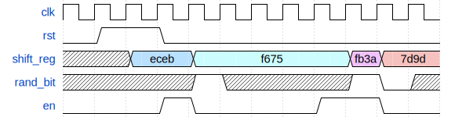

# ECE 411: mp_verif README

## Introduction to SystemVerilog and Verification

**This document, README.md, forms the specification for the machine
problem. For a more comprehensive summary, see [GUIDE.md](./GUIDE.md).**

# Part 1: SystemVerilog Refresher / LFSR

Files related to this part are in `mp_verif/lfsr`.

Your task is to implement a 16-bit XOR-based Fibonacci linear feedback shift
register (primitive polynomial $x^{16} + x^{14} + x^{13} + x^{11} +
1$) in RTL.

Here is the expected behavior:

You must pass the provided testbench.

Files that you will be graded on:
- `lfsr/hdl/lfsr.sv`

The autograder will replace all other files in `lfsr/`.

# Part 2: Fixing Common Errors

In this exercise, you will fix some of the common issues you will encounter across ECE 411 MPs.

## Part 2.1: ALU

Files related to this part are in `mp_verif/alu`.

You are to fix a given ALU, located at `alu/hdl/alu.sv`.
This RTL has some bugs. You should fix all the bugs (listed in [GUIDE.md](GUIDE.md)).

The ALU obeys the following timing diagram:

An incomplete testbench is provided. You are required to
complete it to verify your ALU implementation.

The operations supported by this ALU are (all unary operations act on
input `a` and ignore input `b`):

| Operation | `op` Code |
| --- | --- |
| Bitwise AND | 0 |
| Bitwise OR  | 1 |
| Bitwise NOT | 2 |
| Add | 3 |
| Subtract | 4 |
| Left shift | 5 |
| Right shift | 6 |

Files you will be graded on:
- `alu/hvl/vcs/verify.svh`: The autograder will exercise your testbench on
  a reference design to check that your testbench has 100% coverage.
- `alu/hdl/alu.sv`: The autograder will run a reference testbench on
  your ALU implementation. Your ALU must also pass synthesis and timing.

The autograder will replace all other files in `alu/`.

## Part 2.2: Combinational Loops

Files related to this part are in `mp_verif/loop`.

The provided design in `loop/hdl` has a combinational loop.
You are required to find the loop, fix it, and pass the provided testbench.

Files you will be graded on:
- `loop/hdl/foo.sv`
- `loop/hdl/bar.sv`

The autograder will replace all other files in `loop/`.

## Part 2.3: Timing / Tree

Files related to this part are in `mp_verif/tree`.

The provided design in `tree/hdl` does not pass timing.
You are required to modify the design so that it passes timing, while
retaining the original functionality.

Files you will be graded on:
- `tree/hdl/tree.sv`

The autograder will replace all other files in `tree/`.

# Part 3: Constrained Random and Coverage

Files related to this part are in `mp_verif/rand`.

## Specification

You are required to write a set of random constraints in SystemVerilog
to generate valid RISC-V instructions, and implement coverage for this
random testbench. Once finished with both parts, your coverage should
be 100%. In the next part, this constrained random class will be used
to find bugs in an actual RISC-V processor.

To see the list of instructions you need to generate, see Chapter 19
RV32/64G Instruction Set Listings of the [RISC-V 2.2
Specification](https://riscv.org/wp-content/uploads/2017/05/riscv-spec-v2.2.pdf).
The instructions you are required to generate are **all of RV32I, with the
exception of `FENCE*`, `ECALL`, `EBREAK`, and `CSRR*` instructions.**

### Coverpoints

Simple coverpoints that check only certain instruction fields:

- `all_opcodes`: 9 bins. Checks that every opcode is sampled at least once.
- `all_funct7`: 2 bins. There are two possible valid values of `funct7`,
  checks that these occur.
- `all_funct3`: 8 bins. Checks that funct3 takes on all possible values.
- `all_regs_rs1`/`all_regs_rs2`: 32 bins each. Checks that the rs1 and rs2 fields
  across instructions take on all possible values (each register is
  touched).

Cross coverpoints:

- `funct3_cross`: 31 bins. Checks that every valid combination of
  `opcode` and `funct3` is sampled. Ignore instructions that do not
  have a `funct3` field, and invalid encodings of `funct3`. Said
  differently, checks that every instruction that uses `funct3` occurs
  at least once.
- `funct7_cross`: 13 bins. Checks that every instruction that uses
  `funct7` occurs at least once.

## Task Details

The constraints must be written in the file `hvl/vcs/randinst.svh`. The
covergroup is in the file `hvl/vcs/instr_cg.svh`. The files have TODOs
that you must complete to get full credit.

Viewing the coverage reports is highly recommended to debug efficiently.

## Autograder Details

### Random Constraints
To check that you have correctly implemented the random constraints
for generating RISC-V instructions, the autograder will check
that you meet 100.0% coverage on a reference version of the
`instr_cg` covergroup. If you generate any invalid instructions, the
autograder will fail the testcase.

### Coverage
To check that you have correctly implemented coverage, the autograder
checks your coverage report for two sets of stimuli:
- One that does not meet 100.0% coverage.
- One that does meet 100.0% coverage.

Your `instr_cg` covergroup must correctly report the coverage in both
cases.

Files you will be graded on:
- `rand/pkg/types.sv`
- `rand/hvl/vcs/randinst.svh`
- `rand/hvl/vcs/instr_cg.svh`

The autograder will replace all other files in `rand/`.

# Part 4: CPU Verification

Files related to this part are in `mp_verif/cpu`.

You are provided a multicycle RISC-V RV32I CPU in `cpu/hdl/`.
This design has numerous functional bugs that you are required to find
by using both random test vectors and by writing assembly (directed
tests). Two verification tools are provided:
- The provided CPU is correctly hooked up to **RVFI** (RISC-V Formal
  Interface), which is a golden non-synthesizable Verilog model of the
  CPU. RVFI executes in parallel to your core by snooping the memory
  bus and register file commit. If there is a mismatch between your CPU's
  commit and RVFI's commit, an error is reported during simulation.
- **Spike** is the official golden *software* model for RISC-V. Spike can
  be run on manually written assembly code, and outputs an
  instruction trace. Your CPU also automatically prints out its own
  instruction trace. These traces must match for any possible input
  program.

To get started, copy over `rand/hvl/vcs/randinst.svh` and
`rand/hvl/vcs/instr_cg.svh` to `cpu/hvl/vcs/`. Note that the
constraints for loads and stores in `randinst.svh` must be modified to
maintain the "naturally aligned" constraint. The given CPU *does not
support misaligned loads and stores*.

Files you will be graded on:
- `cpu/hdl/cpu.sv`, `cpu/hdl/regfile.sv`: The CPU you submit must fix all provided bugs and correctly
  implement the RISC-V spec, with the exception of `FENCE*`, `ECALL`, `EBREAK`, and `CSRR*` instructions.
- `cpu/pkg/types.sv`: types definition for the CPU.

The autograder will replace all other files in `cpu/`.

# Rubric

## Submission
You will be graded on the files in `main` branch in your class GitHub repository at
the specified deadline.

## Points Breakdown
This MP will be auto-graded out of a total 100 points, assigned to each task as follows.
| Task | Points |
| --- | --- |
| LFSR | 5 |
| ALU | 15 |
| Loop | 5 |
| Tree | 5 |
| Rand | 30 |
| CPU | 40 |

## Input Sanitization
We will run some checks on your code to make sure you do not break the autograder,
unintentionally or not. The specific checks are already in the provided code and scripts.
If you can run and verify your MP locally, you should have no issues with those checks.
Failure on these checks will result in **zero credit** for that specific subpart.

If you do find potential vulnerabilities in the autograder,
you should follow the responsible disclosure procedures.

## Synthesis
We will run synthesis on any `hdl` code you submit for this course. Running synthesis
will tell us two important pieces of information:
1. Is your code synthesizable, in other words, are you writing realizable hardware?
2. Do you meet timing and area constraints?

In this MP, any design that does not pass synthesis without warning and error from the tool will receive **zero credit**
for that specific subpart.

## Lint
We will also run lint on any `hdl` code you submit for this course.
Linting makes sure your code is of acceptable style, and gives us confidence that your synthesis result
is accurate by checking that your code does not contain any uncommon/strange constructs.

In this MP, any design that does not pass lint without warning and error will receive **zero credit**
for that specific subpart.

## Autograder
For all MPs in this course, we will run the autograder on a subset of test cases before the deadline
in order to check compatibility with our system. This is not meant to provide exhaustive
feedback on correctness. The full suite of testcases used for your final grade might only run after
the final deadline, so you should not rely on the AG for feedback.
